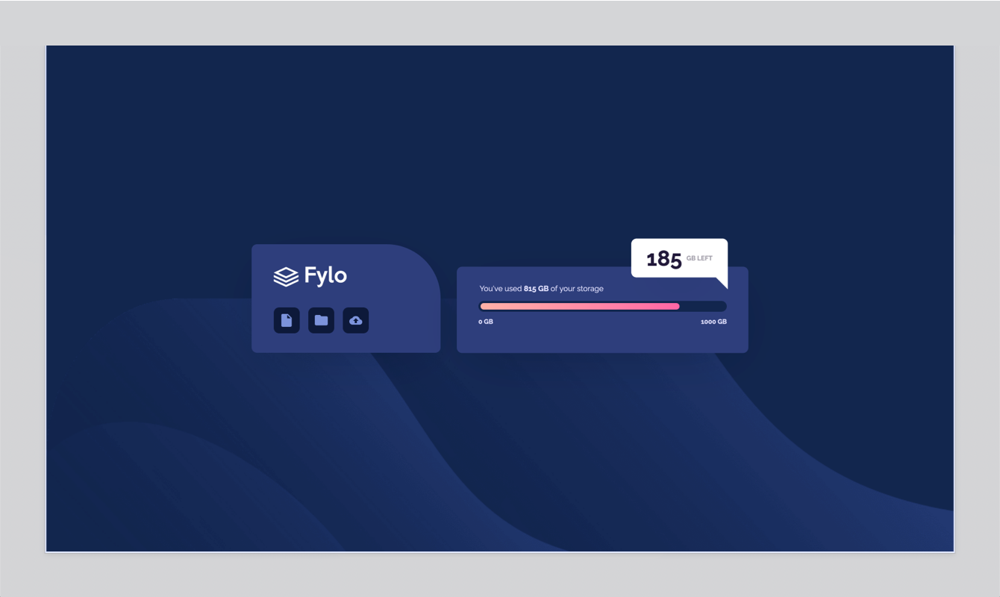

# Fylo data storage component challenge

## Table of contents

- [Overview](#overview)
  - [Screenshot](#screenshot)
  - [Live Page](#live-page)
  - [Built with](#built-with)
- [Author](#author)

## Overview

This is a solution to the [Fylo data storage component challenge on Frontend Mentor](https://www.frontendmentor.io/challenges/fylo-data-storage-component-1dZPRbV5n).

### Screenshot

### Live Page

A live version of this repo can be found [here](https://chekhovs-func.github.io/fylo-data-storage/).

### Built with

- [React](https://reactjs.org)
- [Styled-Components](https://styled-components.com)
- HTML5
- Mobile-first workflow

## Author

- Github - [Robert Butler](https://github.com/chekhovs-func)
